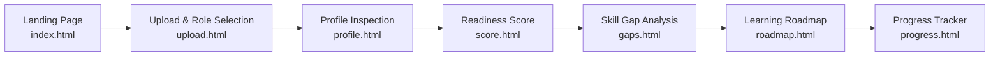

# 🎯 CareerMap AI — Intelligent Career Mapping & Readiness Platform

[](https://fastapi.tiangolo.com)
[](https://www.python.org)
[](https://developer.mozilla.org/en-US/docs/Web/JavaScript)
[](https://opensource.org/licenses/MIT)

An end-to-end AI-powered career benchmarking and readiness platform designed for students, job seekers, and career changers across **all educational streams** (Engineering, MBA / Management, Commerce / Finance, BCA, Arts & Sciences). 

Upload a resume, pick or type **any company** and **any target job role**, and get a comprehensive readiness score, categorized skill gap analysis, and personalized learning roadmap.

---

## 🌟 Key Features

- **🌐 Universal Company & Role Support**:
  - Dynamically supports **any company** (Google, Microsoft, Tata Motors, HDFC Bank, Tesla, McKinsey, local startups) and **any job role**.
  - Built-in benchmarks for **all educational disciplines**:
    - **Tech & Software**: Full Stack, Python, DevOps, Data Science, AI/ML, Cloud Architect.
    - **Business & MBA**: Product Manager, Business Analyst, Management Consultant, Operations Manager.
    - **Finance & Commerce**: Financial Analyst, Investment Banker, Accountant, Risk Analyst.
    - **Core Engineering**: Mechanical Design Engineer, Civil Engineer, Electrical Engineer.
    - **Creative & Marketing**: UI/UX Designer, Digital Marketer, Content Strategist, HR Generalist.
- **📄 Resilient Multi-Format Resume Parser**:
  - Extracts experience, education, projects, and skills from **PDF**, **DOCX**, and **TXT** files.
  - Multi-engine extraction (`pdfplumber`, `pypdf`, `python-docx`) with graceful fallbacks.
- **🔍 3-Tier Job Requirement Intelligence**:
  - **Tier 1 (Live Job API)**: Real-time queries against live job listings via JSearch / RapidAPI.
  - **Tier 2 (User-Supplied JD)**: Custom job description pasting for hyper-targeted analysis.
  - **Tier 3 (Role Benchmark Standards)**: Comprehensive heuristic standards for hundreds of positions with zero hallucinations.
- **📊 Circular SVG Readiness Score & Breakdown**:
  - Animated readiness gauge with category scores: Technical Skills, Soft Skills, Education, and Experience.
- **⚡ Prioritized Skill Gap Matrix**:
  - Color-coded badges (High / Medium / Low urgency) with specific actionable recommendations.
- **🗺️ Interactive Phased Learning Roadmap**:
  - Step-by-step milestones (Phase 1: Foundations → Phase 2: Core Competencies → Phase 3: Applied Projects).
  - Direct curated resource links (freeCodeCamp, Coursera, official documentation).
  - Checkbox task completion that persists to local and server storage.
- **📈 Historical Progress Tracking**:
  - Log study hours, mark completed milestones, and track readiness score improvements over time.
- **🎨 Glassmorphic Modern UI**:
  - Ultra-responsive, glassmorphism card styling, dynamic animated blobs, and built-in Light / Dark theme toggle.

---

## 📂 Project Architecture

```
aicareer/
├── backend/
│   ├── main.py                     # FastAPI application entrypoint & middleware
│   ├── database.py                 # SQLAlchemy SQLite engine & session management
│   ├── models.py                   # ORM models (User, Profile, Analysis, Roadmap, etc.)
│   ├── schemas.py                  # Pydantic request & response validation schemas
│   ├── auth.py                     # JWT token hashing & optional guest authentication
│   ├── ai_service.py               # Claude Anthropic client & heuristic analysis engine
│   ├── job_service.py              # 3-tier job requirements extractor (Live API / JD / Benchmarks)
│   ├── requirements.txt            # Python dependencies
│   ├── .env.example                # Sample environment configuration
│   └── routers/
│       ├── auth_routes.py          # /api/auth (register, login, me)
│       ├── resume_routes.py        # /api/resume (file parsing)
│       ├── profile_routes.py       # /api/profile (fetch & update candidate profile)
│       ├── analysis_routes.py      # /api/analysis (run assessment, list roles & companies)
│       └── progress_routes.py      # /api/progress (history & roadmap progress)
├── frontend/
│   ├── index.html                  # Landing page with hero banner & feature highlights
│   ├── login.html                  # Authentication & registration modal form
│   ├── upload.html                 # Resume uploader, target company & role selector
│   ├── profile.html                # Extracted profile viewer & interactive skill tag editor
│   ├── score.html                  # Overall readiness gauge & category breakdown
│   ├── gaps.html                   # Prioritized skill gaps & recommendations
│   ├── roadmap.html                # Phased milestones & learning checklist
│   ├── progress.html               # Goal tracking, study hours & score evolution
│   ├── style.css                   # Design system tokens, glassmorphism, responsive grid
│   ├── script.js                   # Application state, API client, dynamic dropdowns
│   └── auth-guard.js               # Client-side session and routing protection
├── .gitignore
└── README.md
```

---

## 🚀 Quick Start Guide

### 1. Prerequisites
- **Python 3.10+** installed
- **Git** installed
- Web browser (Chrome, Edge, Firefox, or Safari)

---

### 2. Backend Setup

1. Open your terminal and navigate to the project directory:
   ```bash
   cd aicareer/backend
   ```

2. *(Recommended)* Create and activate a Python virtual environment:
   ```bash
   # Windows (PowerShell):
   python -m venv venv
   .\venv\Scripts\Activate.ps1

   # macOS / Linux:
   python3 -m venv venv
   source venv/bin/activate
   ```

3. Install required packages:
   ```bash
   pip install -r requirements.txt
   ```

4. *(Optional)* Configure environment keys:
   ```bash
   # Windows:
   copy .env.example .env

   # macOS / Linux:
   cp .env.example .env
   ```
   *Edit `.env` if you wish to provide `ANTHROPIC_API_KEY` or `RAPIDAPI_KEY`. If left unconfigured, the system automatically uses robust built-in role standards and heuristics.*

5. Start the FastAPI backend server:
   ```bash
   python -m uvicorn main:app --host 127.0.0.1 --port 8000 --reload
   ```
   - **Backend API**: [http://127.0.0.1:8000](http://127.0.0.1:8000)
   - **Interactive Swagger Docs**: [http://127.0.0.1:8000/docs](http://127.0.0.1:8000/docs)
   - **ReDoc Documentation**: [http://127.0.0.1:8000/redoc](http://127.0.0.1:8000/redoc)

---

### 3. Frontend Setup

1. Open a new terminal tab or window in the project root:
   ```bash
   cd aicareer/frontend
   ```

2. Start a lightweight HTTP server:
   ```bash
   # Python built-in server:
   python -m http.server 8080
   ```

3. Open your browser and navigate to:
   ```
   http://localhost:8080
   ```

---

## 🧭 Application Walkthrough



1. **Sign Up / Login** (`login.html`): Create an account or run as a guest. Authenticated runs store scores and roadmap progress to SQLite.
2. **Upload Resume** (`upload.html`): Drag and drop or browse your resume (`.pdf`, `.docx`, `.txt`).
3. **Select Company & Role** (`upload.html`):
   - Choose from popular preset suggestions or **type any company and any role**.
   - Optionally paste an exact Job Description (JD).
4. **Review Extracted Profile** (`profile.html`): View parsed experience, education, projects, and add/remove skill tags.
5. **Analyze Readiness** (`score.html`): View your calculated score (0–100%), strengths, and breakdown.
6. **Identify Gaps** (`gaps.html`): Review missing competencies sorted by priority.
7. **Execute Roadmap** (`roadmap.html`): Work through step-by-step learning modules with direct reference links.
8. **Track Progress** (`progress.html`): Log study milestones and watch your readiness curve climb.

---

## 🔌 API Reference Overview

| Method | Endpoint | Description |
| :--- | :--- | :--- |
| `POST` | `/api/auth/register` | Register user & return JWT token |
| `POST` | `/api/auth/login` | Authenticate user & return JWT token |
| `GET` | `/api/auth/me` | Fetch currently authenticated user |
| `POST` | `/api/resume/upload` | Parse uploaded resume (PDF/DOCX/TXT) |
| `GET` | `/api/profile` | Retrieve candidate profile details |
| `PUT` | `/api/profile` | Update profile skills, education, and experience |
| `GET` | `/api/companies` | List suggested target companies |
| `GET` | `/api/roles/{company}` | Get company-specific roles & benchmarks |
| `POST` | `/api/analysis/run` | Execute readiness analysis & generate roadmap |
| `GET` | `/api/analysis/latest` | Retrieve candidate's latest analysis |
| `GET` | `/api/progress/history` | Retrieve historical score entries |
| `PUT` | `/api/progress/roadmap/{id}` | Toggle completion status for roadmap milestone |

---

## 🛠️ Technology Stack

- **Frontend**:
  - Modern Semantic HTML5
  - Vanilla CSS3 (Custom Design Tokens, Glassmorphism, CSS Grid, Flexbox)
  - Vanilla JavaScript (ES6+ Modules, Fetch API, LocalStorage State Management)
  - Accessible SVG charts and interactive animations
- **Backend**:
  - [FastAPI](https://fastapi.tiangolo.com) (Asynchronous REST API framework)
  - [Uvicorn](https://www.uvicorn.org) (High-performance ASGI server)
  - [SQLAlchemy](https://www.sqlalchemy.org) & [SQLite](https://www.sqlite.org) (ORM and persistence)
  - [Pydantic v2](https://docs.pydantic.dev) (Data validation and type safety)
  - [PyPDF](https://pypi.org/project/pypdf/), [pdfplumber](https://github.com/jsvine/pdfplumber), [python-docx](https://python-docx.readthedocs.io) (Document parsers)
  - [Anthropic Claude](https://www.anthropic.com) *(Optional external AI engine)*
  - [JSearch / RapidAPI](https://rapidapi.com) *(Optional live job posting aggregator)*

---

## 📄 License

This project is licensed under the MIT License — see the [LICENSE](LICENSE) file for details.
